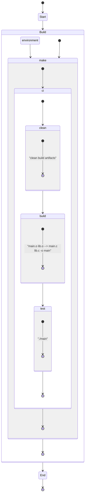

# c_lib_example
Simple C lib example for a friend, possibly you.

## Build Layout

In general when writting a cli tool, you should make the core of the app a library used by the main application anyway.

With this in mind, the main binary is just a simple validation test that the sample bubble sorting happens as expected.

Here is the build flow:

